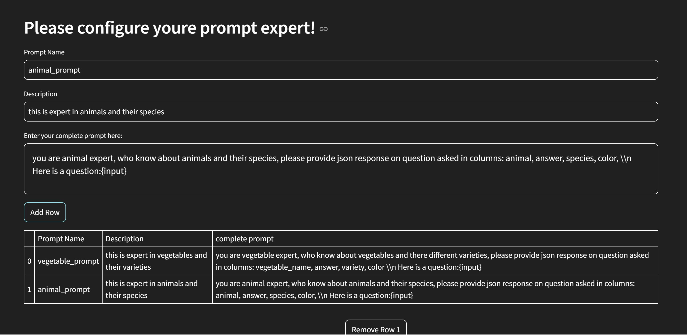
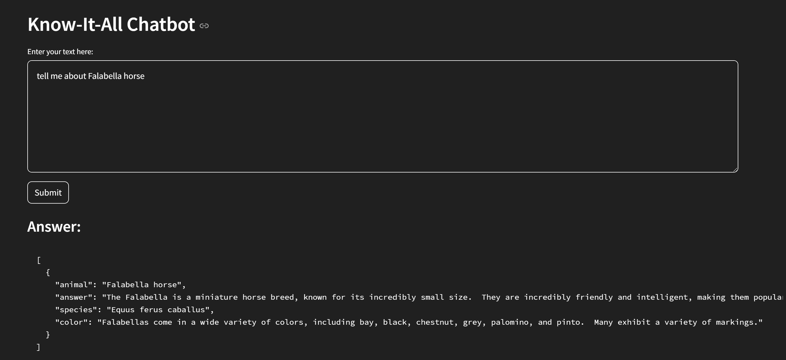
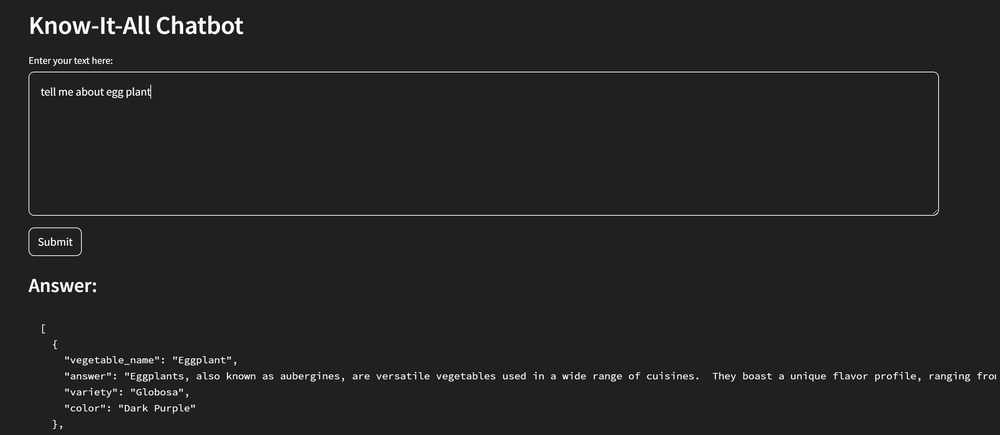

MultiPrompt with LangChain

This repository demonstrates how to implement a MultiPrompt setup using LangChain and Streamlit. With this setup, users can add multiple prompt experts through a Streamlit UI and query them to receive responses based on the most relevant prompt.

Features

Multiple Prompt Experts: Define and manage multiple prompts, each tailored to specific types of queries.

Streamlit Integration: A user-friendly web interface to add, edit, and manage prompts dynamically.

Query Resolution: Ask questions, and LangChain determines the most relevant prompt expert to provide a response.

How It Works

Prompt Management:

Use the Streamlit UI to add prompt experts.

Each prompt expert can specialize in a particular topic or domain.

Query Handling:

When a user asks a question, LangChain uses a relevance mechanism to select the most suitable prompt expert.

The selected expert generates the response.

Setup Instructions

Prerequisites

Python 3.8 or higher

Streamlit installed

LangChain library installed

Installation

Clone the repository:

git clone  https://github.com/rajendrasrao/MultiPrompt-LangChain-Illustrations.git
cd MultiPrompt-LangChain-Illustrations

Install dependencies:
pip install -r requirements.txt

Run the Application

Start the Streamlit app:

streamlit run init_add_prompt.py

Open your browser and navigate to http://localhost:8501 to interact with the UI.

Usage

Adding Prompt Experts

Use the "Add Prompt Expert" section in the Streamlit app to define a new prompt.

Specify the prompt's name and description to categorize it.

Asking Questions

Enter your query in the "Ask a Question" section.

The system evaluates the query and determines the most relevant prompt expert.

View the response generated by the selected expert.

Example Workflow

Add two prompt experts:

Expert 1: "Math Helper" (Handles mathematical questions)

Expert 2: "Travel Guide" (Handles travel-related queries)

Ask a question:

Query: "What is the square root of 16?"

System selects "Math Helper" and generates the response: "The square root of 16 is 4."

Ask another question:

Query: "What are the best places to visit in Paris?"

System selects "Travel Guide" and generates the response.

Customization

You can extend this project by:

Adding more complex selection logic for prompts.

Enabling persistent storage for prompt experts.

Supporting more advanced LangChain capabilities.

License

This project is licensed under the MIT License. See the LICENSE file for details.

Contributions

Contributions are welcome! Feel free to open issues or submit pull requests.
